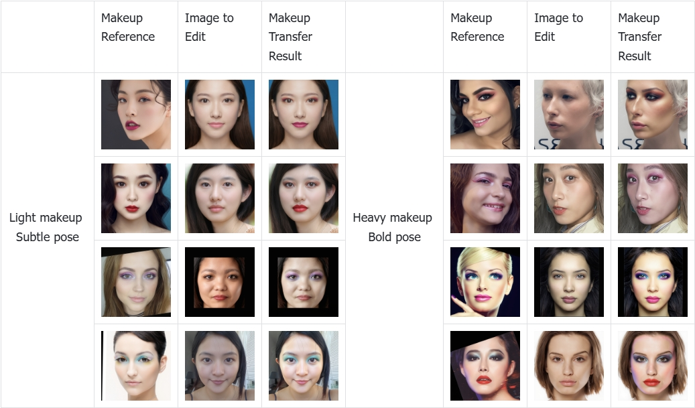

# FLUX-Makeup: High-Fidelity, Identity-Consistent, and Robust Makeup Transfer via Diffusion Transformer

[](https://huggingface.co/qihoo360/FLUX-Makeup) [](https://arxiv.org/abs/2508.05069)



We propose **FLUX-Makeup**, a high-fidelity, identityconsistent, and robust makeup transfer framework that eliminates the need for any auxiliary face-control components.

## 💪 Highlight Feature


- **Core Strengths:** FLUX-Makeup delivers high-fidelity, consistent, and robust makeup transfer using only a 'source + reference' input—the most natural interaction format—without the need for any additional facial control modules.
- **Data Engine & HQMT Dataset:** We developed an extensible, filterable, and quality-controlled data generation pipeline, and curated a high-quality paired makeup dataset containing over 50,000 samples, named HQMT.
- **Architecture: Decoupled Feature Injection:** Through RefLoRAInjector, we define two sets of low-rank projections to achieve precise extraction of makeup-related information while effectively preventing identity collapse and background distortion.

## 🧩 Environment Setup


Depending on your use case, please install the corresponding dependencies:

### 1. For Evaluation
If you want to run the evaluation scripts (e.g., sh eval.sh):

```
pip install -r requirements.txt
```
### 2. For ComfyUI
If you want to use the model within the ComfyUI workflow:

```
pip install -r requirements_comfyUI.txt
```

## 📂 Preparation of Pretrained Models

We provide pretrained weights for evaluation and deployment. Please download the `checkpoint.pt` files from [here](https://huggingface.co/qihoo360/FLUX-Makeup) and place them in the model directory.
Also, please download the `79999_iter.pth` files from [here](https://huggingface.co/qihoo360/FLUX-Makeup) and place them in the model directory.
In addition, download the pretrained weights of **Flux-Kontext.dev** from [here](https://huggingface.co/black-forest-labs/FLUX.1-Kontext-dev) to serve as the backbone model.

#### For ComfyUI Users
Please place the models in the following paths to ensure compatibility with the ComfyUI integration:
* `Flux_Makeup_ComfyUI/models/stable_makeup/Flux-Makeup-model/checkpoint.pt`
* `Flux_Makeup_ComfyUI/models/stable_makeup/face-parsing.PyTorch/79999_iter.pth`
* `Flux_Makeup_ComfyUI/models/stable_makeup/FLUX.1-Kontext-dev/`

## 📂 ComfyUI

You can use ComfyUI within Flux_Makeup_ComfyUI
  
  

## ⏳ Inference Pipeline

Here we provide the inference code for our FLUX-Makeup.

  

  

```
sh eval.sh
```


## 🌸 Acknowledgement

  

  

This code is mainly built upon [Diffusers](https://github.com/huggingface/diffusers/tree/main), [Flux](https://github.com/huggingface/diffusers/tree/main/src/diffusers/pipelines/flux), [Stable-Makeup](https://github.com/Xiaojiu-z/Stable-Makeup) and [ComfyUI_Stable_Makeup](https://github.com/smthemex/ComfyUI_Stable_Makeup) repositories. Thanks so much for their solid work!


If you find this repository useful, please consider citing our paper:
```
@article{zhu2025flux,
  title={FLUX-Makeup: High-Fidelity, Identity-Consistent, and Robust Makeup Transfer via Diffusion Transformer},
  author={Zhu, Jian and Liu, Shanyuan and Li, Liuzhuozheng and Gong, Yue and Wang, He and Cheng, Bo and Ma, Yuhang and Wu, Liebucha and Wu, Xiaoyu and Leng, Dawei and others},
  journal={arXiv preprint arXiv:2508.05069},
  year={2025}
}

```

  
